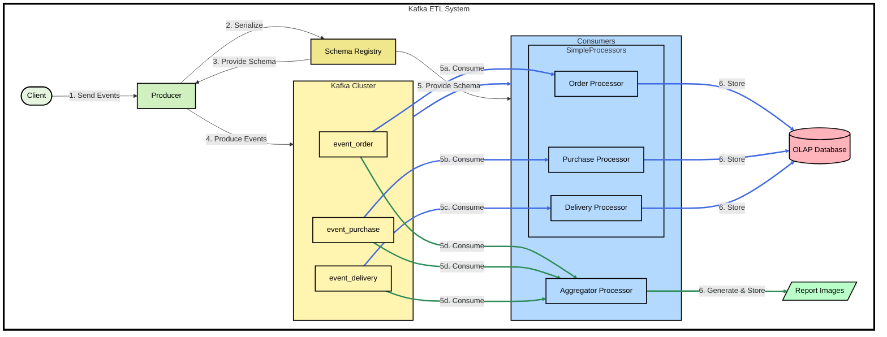
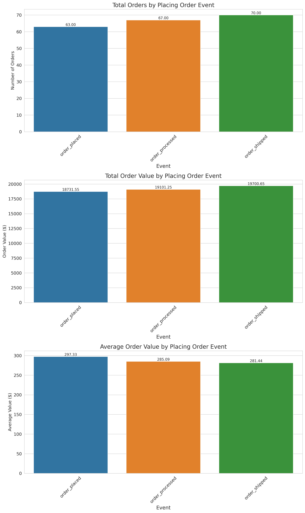
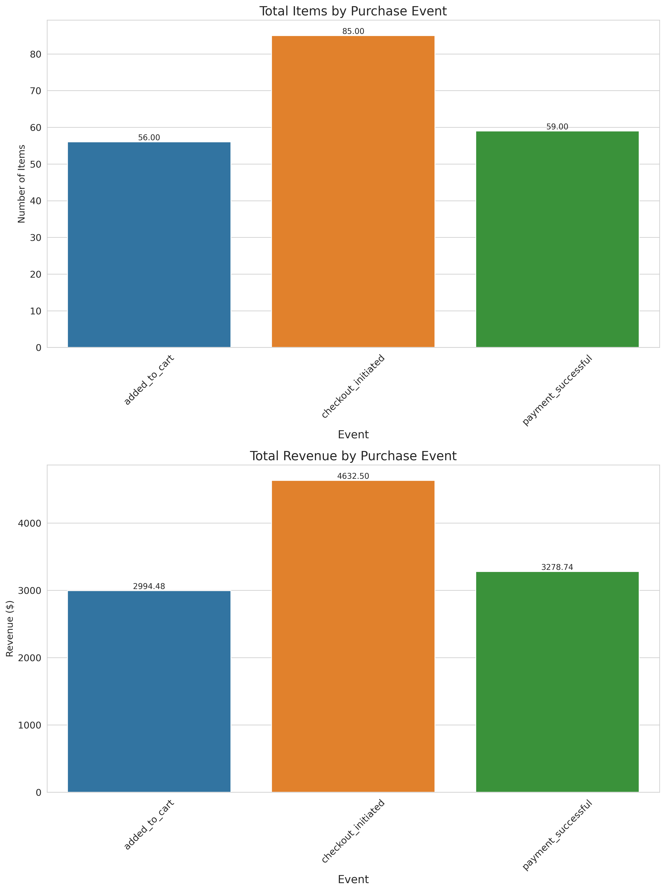
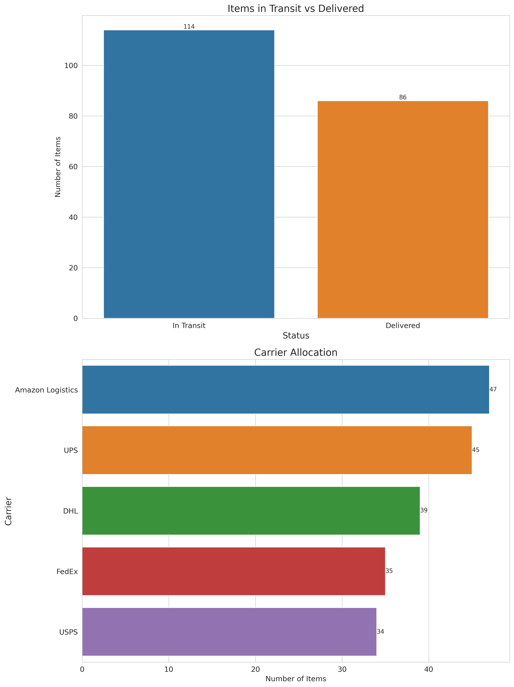

# Kafka Realtime ETL

This project is a simple example of a real-time ETL pipeline using Kafka, Schema Registry, Postgres, and Python.

## Setup
Imagine a scenario where your application is producing events data and you want to create a real-time ETL pipeline to process the event & do some operation on it. This project is a simple example of how you can achieve this using Kafka, Schema Registry, Postgres, and Python.

In this project we do the following:
1. Simple Processor - We have a simple processor that reads the events from the Kafka topic and stores the data in the Postgres database.
2. Aggregator - We have an aggregator that reads the events from the Kafka topic, aggregates the data, generates a chart & saves it in the event_summary_charts folder.

> PS - You can then create visualizations on top of it to create a real-time analytics dashboard using Apache Superset or any other BI tool.



## Running the application

1️⃣ Create a `.env` file by copying the `.env.dev` file and updating the values as needed. Build the application with the following command:
```bash
docker compose build
```

2️⃣ Start the Kafka, Schema Registry and Postgres containers with the following command:
```bash
docker compose up -d kafka schema-registry postgres control-center
```

3️⃣ Start the producer once the Kafka container is running & the application is initialized:
```bash
docker compose up -d producer
```
The application will start at `http://localhost:8080`.

4️⃣ Generate events data - I have created a script to generate events data. It generates events data (by hitting the `/track` api) and sends it to the Kafka topic
```bash
python3 src/utils/generate_events.py
```

5️⃣ Start the Simple Processor Consumers
```bash
docker compose up -d consumer-purchase consumer-order consumer-delivery
```
The consumers will read the event from corresponding topics and simply save the data to the Postgres database. You can modify the `process_events` function in the  file to process the data as needed.

> **Note**
> This is to demonstrate that we can have one consumer per event type and process the data as needed.

View the logs -
```bash
docker compose logs -f --tail 10 consumer-order consumer-purchase consumer-delivery
```
Since, I am processing in batches of 100, we will see the following logs:
```bash
consumer-purchase  | Starting the simple_processor consumer with arguments: purchase
consumer-delivery  | Starting the simple_processor consumer with arguments: delivery
consumer-order     | Starting the simple_processor consumer with arguments: order
consumer-order     | 2024-07-05 13:55:16.106 | INFO     | __main__:process_events:60 - Processed and stored 100 events
consumer-order     | 2024-07-05 13:55:16.158 | INFO     | __main__:process_events:60 - Processed and stored 100 events
consumer-purchase  | 2024-07-05 13:55:21.112 | INFO     | __main__:process_events:60 - Processed and stored 100 events
consumer-delivery  | 2024-07-05 13:55:21.112 | INFO     | __main__:process_events:60 - Processed and stored 100 events
consumer-delivery  | 2024-07-05 13:55:21.168 | INFO     | __main__:process_events:60 - Processed and stored 100 events
consumer-purchase  | 2024-07-05 13:55:21.169 | INFO     | __main__:process_events:60 - Processed and stored 100 events
```

We can also verify that the data is processed & stored in the Postgres database by the consumer:
```bash
# Login to the Postgres container
docker container exec -it postgres "/bin/bash"

# Connect to the Postgres database
psql -U postgres

# Connect to the postgres database
\c postgres

# List the tables
\dt

# Query the table
SELECT COUNT(*) FROM public.processed_events; # 600
SELECT event_type, count(event_type) FROM public.processed_events GROUP BY event_type; # 200 each for order, purchase, delivery
SELECT event_name, count(event_name) FROM public.processed_events GROUP BY event_name; # this will show the count of each event name
```

6️⃣ Start the `Aggregator Consumer` once the consumer is running:
```bash
docker compose up -d consumer-aggregator
```
The aggregator consumer will read the event from the `purchase` topic, aggregate the data, generate a chart & save it in the event_summary_charts folder on the host. 

> **Note**
> This is to demonstrate that we can have one consumer to aggregate the data from multiple topics and process the data as needed.


Order Summary Chart:


Purchase Summary Chart:


Delivery Summary Chart:



7️⃣ Start the ***correction mechanism*** once the consumer is running:
```bash
docker compose up -d correction_mechanism
```
The correction mechanism will read data from the Dead Letter Queue (DLQ) and fix any issues in the event data. The correction mechanism will then send the corrected data back to the original topic.

